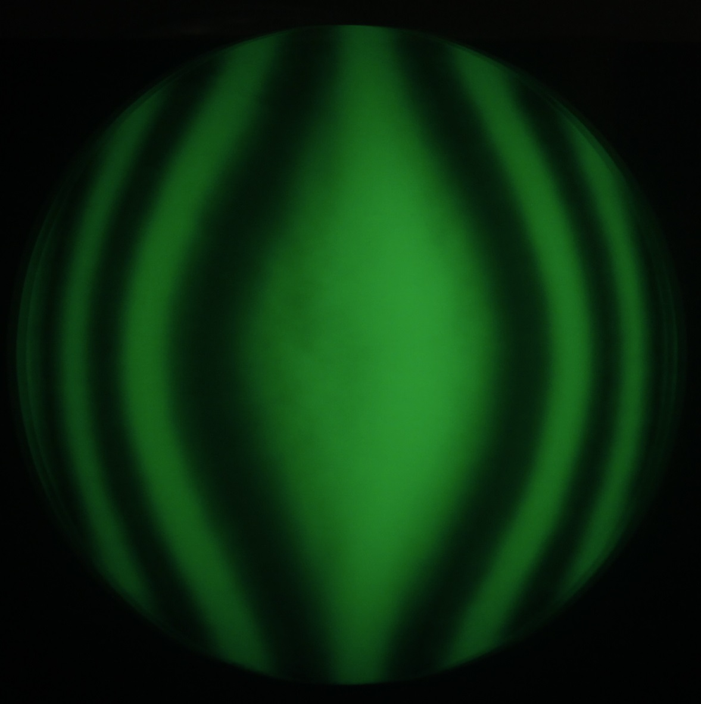
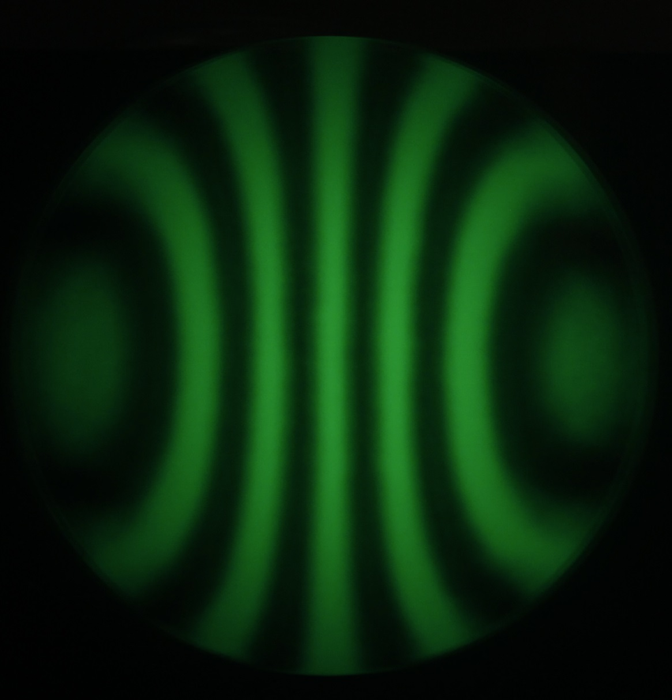

# An hyperbolic 203mm f/3.5 mirror

Here are files about the making of an hyperbolic (conic -1.32) mirror tuned for the Baader MPCC coma corrector.

I started by buying a mirror advertised as a 203mm f/4 mirror. You can see in the `base mirror (ouch)` directory that I was in for a surprise ! It was a very, very bad f/5 mirror.

The `grinding` directory shows the tool and end spherometer measurement before polishing.

The `polishing` directory has pictures of my lap and trimming method. I pushed the mirror for ~6h30 before reaching a good spherical polish to the edge. It's plate glass.

The `references` directory has reference pictures of ronchis for a 203mm mirror corrected for various f/ratios. I'm aiming for this before resorting to interferometry.

The `sessions` directory contains a picture of my figuring lap(s) and inside/outside ronchis for each sessions. Still a lot of work to do !

## Update 2023-03-17

## Update 2022-12-03
The scope is completed and waiting to be painted.

## The very bad bought mirror 

Pictures are worth a lot of words : 

/Annotation%202022-02-02%20152134.jpg)

/_MG_7753.JPG)

## Grinding

Grinding was quite straightforward, I ended up at 718mm f.l. without trouble, at the exception of going back to 15 micron because of a small scratch.

Time estimate :  
- 1 hour at #80 carbo
- 1 hour at #180 carbo
- 45mn at #220 carbo
- 1 hour at #320 carbo
- 45mn at #400 carbo
- 45mn at #600 carbo
- 1 hour at 25 micron alox
- 45mn at 15 micron alox
- 45mn at 9 micron alox
- 15mn at 5 micron alox (scratch)
- 45mn at 15 micron alox
- 1 hour at 9 micron alox
- 30 minutes at 5 micron alox

You can see that I ground in a "toughtless" mode, just put a podcast or some music on, and do 1 hour or 45mn each time. In case of any doubt, just push longer.

## Initial polishing

Quite straightforward too, I just pushed for 5h30 until there was no more scatter at the edge, with sessions of no less than 45 minutes.
Total polishing time : 5h30

## Spherical polish

After the edge was polished out, 2 hours with longer strokes pushed the sphere to the edge. I did another 30 minutes to have straighter bars and a really clean edge.
Total polishing time to this point : 7h30 

## Rough correction

I copied Ed Jones's method, visible on YouTube under the title "Parabolizing a 8" f/3". I had no LP66 at the time, and used a 80mm pitch lap, walking the barrel with straight and oval strokes. Correction progressed in a surprisingly smooth way up to the parabola (-1 conic). I started to introduce local changes at that time to reach -1.32, which in hindsight wasn't the best idea. I should just have followed Ed's method to the hyperbola.
I arrived to an approximate parabola (-1 best fit conic) in 2 hours and 40 minutes, doing 10 to 20 minutes at a time, then measuring.
Total polishing time to this point : around 10 hours. 

## Final figuring

I used a 114mm tool to smooth things and prevent astigmatism to set when I had the slightest doubt about it. The 80mm tool was used to lower the center and edge, and a 20mm tool doing small "coil" shaped strokes over the center and edge, to lower them a bit more. I fighted a turned up edge that did not seem to want to lower, all along figuring.

It finally reduced to 1/10 wave and I called the mirror done. The final analysis shows "holes" coming from a scratch on the beamsplitter cube of my Bath interferometer, and their position is always the same, no matter how I rotated the mirror. So, I guess the mirror is a bit better than my last analysis shows (since it has these two holes near the edge), around 1/0 wave P/V.

Final figuring took about 30 hours, maybe 1 hour of actual polishing, and around 30 of testing and wondering cluelessly about what to do next... but less cluelessly than last year (-; .

